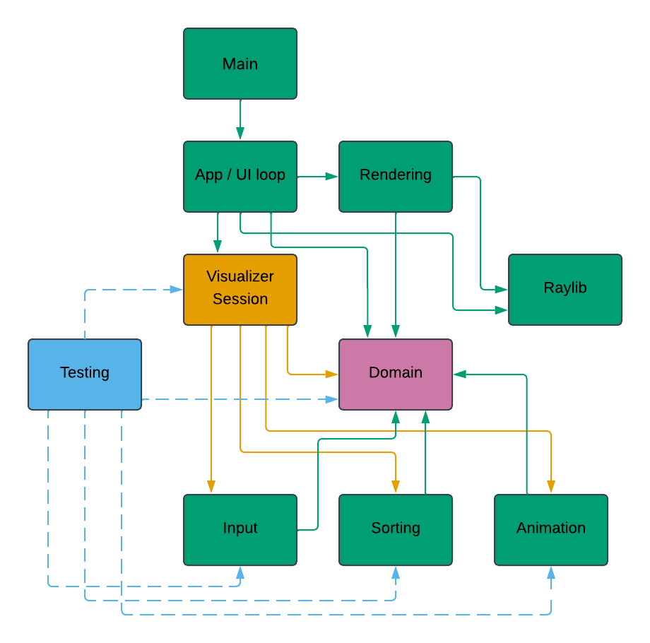

# Sorting Visualizer

A real-time sorting algorithm visualizer written in C++20 with raylib.

The application separates input generation, sorting, event replay, animation, and rendering so that sorting behavior can be tested independently of the graphical interface. Each algorithm produces a replayable event trace that drives the visualization and supports automated correctness checks. The current version includes bubble sort, insertion sort, selection sort, configurable input generation, playback controls, and a keyboard-driven interface.

## Platform Support

- **Windows:** Full support. Build and run the visualizer application.
- **Linux/macOS:** Build and run tests only (no graphical display support configured currently).

## Demo


## Build And Run

From the project root in PowerShell:

```powershell
cmake -S . -B build
cmake --build build --config Debug
.\build\Debug\sorting_visualizer.exe
```

To run the development tests:

```powershell
cmake --build build --config Debug
.\build\Debug\sorting_tests.exe
```

The helper script does the configure and build steps:

```powershell
.\scripts\build.ps1
```

For a release build:

```powershell
.\scripts\build.ps1 -Config Release
.\build\Release\sorting_visualizer.exe
```

The first configure step may download raylib through CMake `FetchContent`.

## Current Status

The project currently has:

- a domain model for algorithms, sortable items, sort specs, sort events, and visualizable sort state
- an input generator that creates `std::vector<SortItem>` from `SortInputSpec`
- input-generator, sorting, animation, and `VisualizerSession` tests that run through the `sorting_tests` console runner with failure details
- stability checks for sorting algorithms, recorded as required for stable algorithms and diagnostic for naturally unstable algorithms
- event replay checks that verify `SortTrace::events` can reconstruct `SortTrace::finalItems`
- a sorting layer with bubble sort, insertion sort, and selection sort implemented as pure event-producing algorithms
- an animation player that can load a completed sort trace, step through events, reset, and expose a `SortState`
- animation tests that cover loading, stepping compare/swap/move/mark-sorted events, seeking, backward stepping, completion, stepping after completion, and replaying a real `SortTrace`
- a raylib renderer that draws `SortState` as bars without knowing sorting details
- a realtime app path that generates input, runs the selected algorithm, loads the trace into `AnimationPlayer`, and renders playback
- keyboard controls for play/pause, reset, one-event forward/backward stepping while paused, playback speed, draft item-count edits, draft algorithm selection, draft value-spec selection, draft initial-order selection, and explicit apply/regenerate
- a draft-vs-loaded settings model so changing item count does not invalidate the active sort trace
- a pure C++ `VisualizerSession` that owns settings transitions and playback policy independently of raylib
- a per-frame event cap so high item counts and fast playback stay responsive

The app boundary is now split deliberately: `App.cpp` owns raylib input,
layout, and drawing, while `VisualizerSession` owns draft-vs-loaded settings,
run regeneration, and playback state. The next major design pressure will come
from custom buttons, sliders, and selectors rather than from the core layers.

## Module Dependencies



An arrow from A to B means that A depends on B. Dashed arrows represent test-only dependencies.

`build/` is generated output and should not be treated as source architecture.

## Dependency Direction

The intended dependency direction is:

```text
main -> App / UI loop

App / UI loop -> Rendering
App / UI loop -> VisualizerSession
App / UI loop -> Raylib
App / UI loop -> Domain

Rendering -> Raylib
Rendering -> Domain

VisualizerSession -> Domain
VisualizerSession -> Input
VisualizerSession -> Sorting
VisualizerSession -> Animation

Input -> Domain

Sorting -> Domain

Animation -> Domain

Testing -> VisualizerSession
Testing -> Input
Testing -> Sorting
Testing -> Animation
Testing -> Domain

Domain -> nothing project-specific
```

raylib should stay at the edge of the program. In normal source code, only `app` and `rendering` should include `<raylib.h>`. Most direct drawing calls should eventually live in `rendering`, while `app` owns the window and main loop.

## Layer Responsibilities

### `domain`

Defines the shared vocabulary:

- algorithm names
- sortable items
- input and run specifications
- sort events
- visualizable sort state

The domain layer should not contain raylib types, drawing code, keyboard/mouse handling, frame timing, random input generation, tests, or sorting algorithm implementations.

### `input`

Creates starting arrays from `SortInputSpec`.

The shape is:

```text
SortInputSpec
  -> generate raw values from ValueSpec
  -> arrange those values using InitialOrderSpec
  -> wrap values into SortItem objects with stable ids
```

The input layer should not know which algorithm will run, animate events, render output, or poll raylib input.

### `sorting`

Owns algorithm implementations.

The public entry point is `runSort(Algorithm, const std::vector<SortItem>&)`. It returns a `SortTrace`, which contains:

- `finalItems`: the sorted result
- `events`: replayable sort events
- `stats`: comparisons, swaps, and moves

Sorting code should not know about raylib, frame timing, colors, windows, animation speed, or user controls.

### `animation`

Turns sorting events into visualizable state over time.

Animation owns replay state such as current item order, sorted marks, the current event position, reset, completion, seeking, and single-step playback. It exposes a `SortState` for rendering.

The current implementation is intentionally step-based:

```text
initial items + SortEvents -> AnimationPlayer -> SortState
```

The app-layer `VisualizerSession` owns play/pause, speed, and frame-time policy
by repeatedly calling this step-based core.

Backward stepping and future timeline controls should use
`AnimationPlayer::seekToEventPosition`, not reverse-event logic in app code.

### `rendering`

Draws the current `SortState` with raylib.

Rendering owns chart drawing: colors, bars, and pixel geometry inside an
app-provided chart rectangle. App-level labels, panels, and window layout stay
in `app`. Rendering should not know how sorting algorithms work.

The app currently owns the high-level layout rectangles because controls,
settings text, and future mouse hit boxes all compete for screen space. The
renderer receives the chart rectangle and focuses on drawing `SortState` bars
inside it.

### `app`

The composition root.

`App` owns the main loop and raylib boundary. `VisualizerSession` coordinates
input generation, sorting, and animation without depending on raylib.

`VisualizerSession` owns:

- draft settings, edited by controls
- loaded settings, used to generate the active trace
- explicit apply/regenerate
- playback timing and per-frame event limits

`App.cpp` owns:

- app-level status and controls text
- keyboard mappings for algorithm, value-spec, and initial-order selection
- screen layout and renderer calls

Future controls should issue `VisualizerSession` commands rather than learning
how input generation, sorting, or animation replay work.

### `testing`

Owns development checks for generated input, sorting behavior, and animation replay.

Tests may depend on the modules they test, but production modules should not depend on tests. Input generation should not call input tests, and sorting algorithms should not call sorting tests.

## Core Data Structures

### `SortItem`

```cpp
struct SortItem {
    int value;
    int id;
};
```

`value` is the sortable value. `id` is stable identity, which matters when values are duplicated, moved, or checked for stable sorting.

### `SortInputSpec` And `SortRunSpec`

`SortInputSpec` contains exactly what input generation needs:

- `unsigned int itemCount`
- `ValueSpec valueSpec`
- `InitialOrderSpec initialOrderSpec`
- `std::uint32_t seed`

`SortRunSpec` adds the algorithm choice:

- `Algorithm algorithm`
- `SortInputSpec inputSpec`

This split keeps input generation from depending on an algorithm field it does not use.

### `ValueSpec`

`ValueSpec` is a `std::variant` over value modes:

- `PermutationValueSpec`: values are `1..itemCount`, with no duplicates.
- `RangeValueSpec`: values come from an inclusive range, with `DuplicatePolicy` deciding whether duplicates are allowed.
- `AllEqualValueSpec`: every value is the same.
- `FewUniqueValueSpec`: exactly `uniqueValueCount` distinct values are chosen and each appears at least once.
- `PeriodicValueSpec`: values repeat as `1, 2, ..., periodLength`.

### `InitialOrderSpec`

`InitialOrderSpec` is a `std::variant` over arrangement modes:

- `RandomOrderSpec`
- `AscendingOrderSpec`
- `DescendingOrderSpec`
- `NearlyAscendingOrderSpec`

`NearlyAscendingOrderSpec::disorderFraction` currently controls a number of random swaps after ascending sort. It does not guarantee an exact fraction of out-of-order elements.

### `SortEvent`

`SortEvent` is a `std::variant` of specific event shapes:

- `CompareEvent`: two indices were compared.
- `SwapEvent`: two indices exchanged items.
- `MoveEvent`: one `SortItem` was placed at a destination index.
- `MarkSortedEvent`: one index is known to be finalized.

This avoids one generic event struct with fields that mean different things for different event types.

### `SortTrace`

`SortTrace` is the sorting layer output:

```cpp
struct SortTrace {
    std::vector<SortItem> finalItems;
    std::vector<SortEvent> events;
    SortStats stats;
};
```

The animation layer should replay `events`. The app and testing layer can inspect `finalItems` and `stats`.

## Boundary Checklist

Before adding code to a file, ask:

- Does this code know about raylib? Put it in `rendering` or, if it is window-loop setup, `app`.
- Does this code decide how sorting works? Put it in `sorting`.
- Does this code define how one event changes replay state or event position? Put it in `animation`.
- Does this code decide play/pause, elapsed-frame timing, or playback speed? Put it in app-layer `VisualizerSession`.
- Does this code define shared concepts? Put it in `domain`.
- Does this code generate starting data? Put it in `input`.
- Does this code verify behavior for development? Put it in `testing`.
- Does this code glue modules together? Put it in `app`.

## Roadmap

1. Build custom UI controls against the `VisualizerSession` boundary:
   - keep keyboard and mouse input as thin translations into session commands
   - keep app drawing grouped by purpose: controls, playback status, settings status, sort chart
   - avoid letting buttons or sliders call input generation, sorting, or animation replay directly
2. Turn the proven keyboard actions into simple custom UI controls:
   - buttons for algorithm, value-spec, initial-order, play/pause, reset, and apply
   - an item-count slider that edits `draftSettings` and marks settings dirty
   - later controls for seed, range values, unique-count, period length, and nearly-ascending disorder
3. Continue refining the app layout boundary:
   - keep app-owned panel rectangles explicit
   - keep layout debug drawing disabled by default
   - pass only the chart rectangle into the renderer for now
   - keep raylib drawing at the `app`/`rendering` edge
4. Keep playback policy responsive:
   - tune the per-frame event cap empirically
   - consider item-count-aware speed limits only if the cap is not enough
   - keep `AnimationPlayer::stepForward()` as the tested replay core
   - keep backward stepping and future timeline controls routed through animation seeking
5. Protect the event contract before adding many more algorithms:
   - every new algorithm must pass event replay tests
   - `MoveEvent` semantics should remain especially explicit because it carries a whole `SortItem`
6. Add more algorithms once the app, renderer, and event contract feel stable:
   - shell sort
   - quicksort
   - merge sort
7. Revisit `NearlyAscendingOrderSpec` after the UI needs are clearer:
   - current behavior means "ascending plus random swaps"
   - a stricter "exact fraction out of order" meaning should only be added if the visualizer needs it
